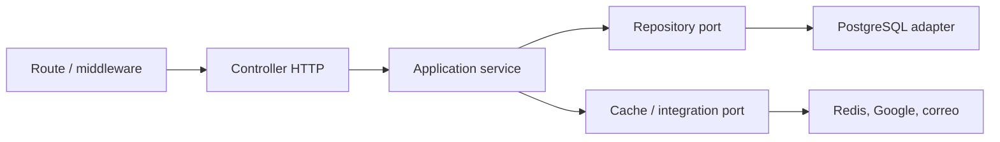

# Arquitectura SOLID

## Objetivo

El proyecto adopta una arquitectura modular orientada a casos de uso. SOLID no significa crear una clase por cada función, sino mantener cada componente con una razón clara de cambio y evitar que las reglas del negocio dependan de Express, PostgreSQL, Redis, Google o Nginx.

## Flujo obligatorio

### Responsabilidades

- **Routes:** URL, autenticación, rol y adaptación de errores asíncronos.
- **Controllers:** traducen `request` a datos simples y convierten el resultado en HTTP.
- **Services:** reglas, validaciones y coordinación del caso de uso. No importan Express ni SQL.
- **Repositories:** consultas y persistencia de una entidad o agregado.
- **Infrastructure:** adaptadores concretos para PostgreSQL, Redis, correo y servicios externos.
- **Container:** único lugar donde se construyen e inyectan dependencias.

## Aplicación de los cinco principios

### S — Responsabilidad única

`ComparacionService` decide si una fotografía puede publicarse; `ComparacionRepository` conoce el SQL; el controlador solo maneja HTTP; `Cache` adapta Redis.

### O — Abierto/cerrado

Se puede agregar almacenamiento S3, filesystem local o un nuevo proveedor de caché creando un adaptador, sin modificar las reglas de publicación.

### L — Sustitución de Liskov

Las pruebas reemplazan repositorio y caché por implementaciones en memoria que respetan las mismas operaciones. El servicio conserva su comportamiento.

### I — Segregación de interfaces

Cada servicio recibe puertos pequeños: el repositorio de fotografías no expone operaciones de pagos, citas o usuarios. Ningún consumidor depende de métodos que no utiliza.

### D — Inversión de dependencias

El dominio recibe objetos por constructor. `container.js` conecta abstracciones con `Database`, `Cache` y repositorios concretos.

## Convenciones obligatorias para código nuevo

1. Un controlador no debe contener SQL.
2. Un servicio no debe recibir `req`, `res` ni importar Express.
3. Un repositorio no decide reglas comerciales.
4. Las integraciones externas deben envolverse en adaptadores.
5. Los errores de negocio usan `AppError` con estado y código estables.
6. Toda regla nueva requiere prueba unitaria del servicio y prueba integral de la ruta.
7. Las dependencias se construyen en `container.js`, no dentro del caso de uso.

## Estrategia de migración del código heredado

La migración es incremental para proteger el sistema funcional:

1. Fotografías y consentimientos.
2. Citas, disponibilidad, cancelación y lista de espera.
3. Pagos e inventario.
4. Autenticación y recuperación.
5. Portal profesional, privacidad y reseñas.
6. Reportes, notificaciones y Google Calendar.

Cada módulo mantiene sus rutas y contratos mientras cambia internamente. Las pruebas integrales deben permanecer aprobadas después de cada extracción.
