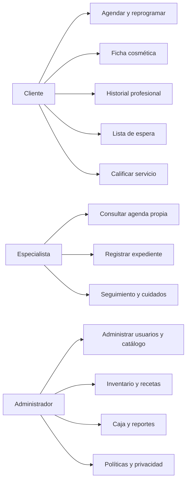
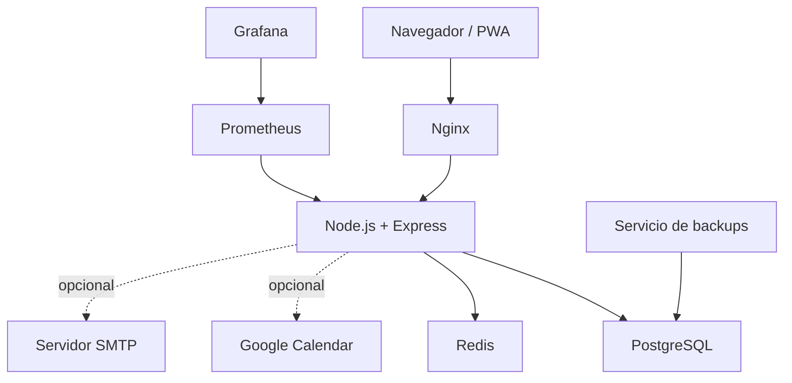
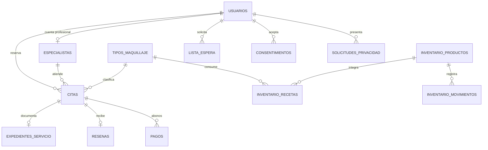
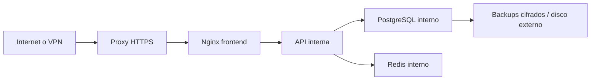

# Requisitos y diseño — Arte & Belleza SENA

## Actores

- Cliente: administra su perfil, agenda, pagos, ficha, historial, reseñas y solicitudes.
- Especialista: consulta únicamente su agenda y expedientes asignados.
- Administrador: gobierna catálogo, personal, agenda, caja, inventario, políticas y reportes.
- Servicios externos: correo, Google Calendar opcional y plataforma de monitoreo.

## Requisitos funcionales

| ID | Requisito | Actor |
|---|---|---|
| RF-01 | Registrar e iniciar sesión con control de intentos | Todos |
| RF-02 | Consultar disponibilidad sin superposiciones | Cliente |
| RF-03 | Crear, reprogramar y cancelar según políticas | Cliente |
| RF-04 | Administrar jornada y bloqueos | Admin/especialista |
| RF-05 | Consultar y actualizar expediente asignado | Especialista |
| RF-06 | Consultar historial y recomendaciones | Cliente |
| RF-07 | Registrar pagos sin superar el saldo | Admin |
| RF-08 | Gestionar lista de espera | Cliente/admin |
| RF-09 | Calificar únicamente citas completadas | Cliente |
| RF-10 | Consumir inventario según receta | Sistema |
| RF-11 | Configurar identidad y políticas | Admin |
| RF-12 | Exportar datos personales y tramitar solicitudes | Cliente/admin |
| RF-13 | Generar reportes y archivos CSV | Admin |
| RF-14 | Sincronizar opcionalmente con Google Calendar | Sistema/admin |

## Requisitos no funcionales

| ID | Requisito |
|---|---|
| RNF-01 | Despliegue reproducible mediante Docker Compose |
| RNF-02 | Contraseñas con bcrypt y tokens JWT |
| RNF-03 | Separación estricta por roles y recursos |
| RNF-04 | PostgreSQL como fuente de verdad y Redis como caché |
| RNF-05 | Migraciones de arranque idempotentes |
| RNF-06 | Backups verificables y restauración documentada |
| RNF-07 | Métricas Prometheus, salud y registros operativos |
| RNF-08 | PWA adaptable a equipos móviles |
| RNF-09 | Protección de datos cosméticos y consentimientos versionados |
| RNF-10 | Continuidad local si una integración externa falla |

## Casos de uso

## Arquitectura

## Relaciones principales

## Reglas de negocio

1. Una especialista solo accede a citas vinculadas con su registro.
2. Una reseña requiere una cita propia en estado completada.
3. Los pagos acumulados no pueden superar el precio histórico de la cita.
4. Una salida de inventario nunca puede producir stock negativo.
5. El consumo automático es idempotente por cita y producto.
6. Las cancelaciones respetan las horas configuradas.
7. La disponibilidad considera duración, intervalo, jornadas, bloqueos, citas y Google FreeBusy.
8. La ficha cosmética no se envía a Google Calendar.
9. Las solicitudes de eliminación requieren revisión administrativa.
10. Redis puede vaciarse sin perder información permanente.

## Matriz mínima de pruebas

| Área | Evidencia automatizada |
|---|---|
| Infraestructura | Salud PostgreSQL y Redis |
| Seguridad | JWT, rol cliente, rol especialista y rol admin |
| Agenda | Disponibilidad, creación y reprogramación |
| Profesional | Agenda propia, expediente y seguimiento |
| CRM | Ficha cosmética e historial |
| Calidad | Reseña y moderación |
| Operación | Inventario, pagos, reportes y configuración |
| Privacidad | Exportación y solicitudes |
| Integraciones | Estado Google, OpenAPI y métricas |

## Despliegue doméstico

No se publican directamente los puertos de PostgreSQL, Redis ni la API.
